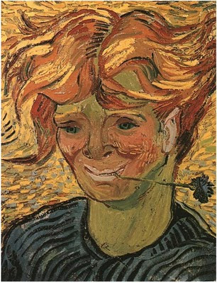

## Image Art

The following notebook takes a target image and a reference image and progressively blends in colors, textures and lines of the reference image to the target image. Images can be any size, realize each iteration will take longer the more information is provided. For large, high quality images, a GPU or parallel processing is recommended. Both images should be relatively the same size. This code is from Deep Learning with Python by Francois Chollet (2018). An example of the results are below and ar e included in the notebook.

### Target Image

### Reference Image

### Result

